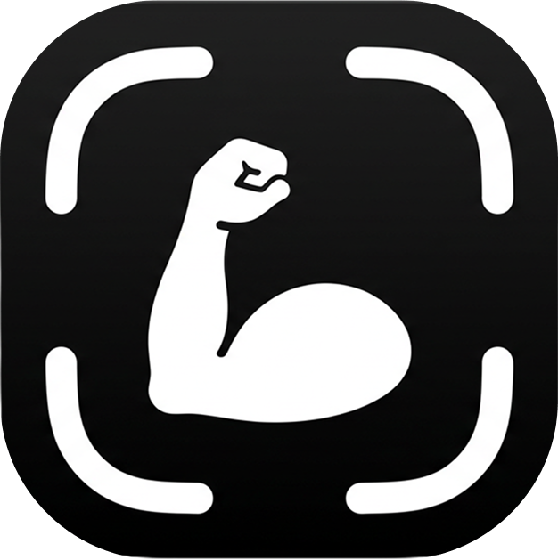

# Visual Style Guide — Recomp

**Phase:** [2 — Content Generation & Optimization](../README.md)
**Source prompt:** [04-visual-style-guide-prompt.md](04-visual-style-guide-prompt.md)
**Grounded in:** [01-deep-research.md](../phase-1/01-deep-research.md) §12–§13, [chatgpt-context.md](../../app-context/chatgpt-context.md) §19, and the current page tokens in `index.html`
**Audience:** A designer, a no-code builder (Framer / Webflow / Lovable), or prompts [#7](../phase-3/07-claude-mockup-template.md) and [#8](../phase-3/08-lovable-implementation-prompt.md). Every token below is specific enough to implement without inventing a second system.

The HubSpot prompt this answers is framed for B2B SaaS. Recomp is a consumer iOS app. Keep the conversion craft (hierarchy, CTA contrast, whitespace, mobile-first). Swap the B2B artifacts: no demo form as the primary CTA, no navy-and-purple SaaS palette, no illustration-led hero. The conversion job is an App Store install (release) or an early-access request (pre-release).

---

## 0. Brand lock — name may change

**Current name:** Recomp
**Current subtitle:** Progress Photo Tracker
**Lockup:** `Recomp` as the wordmark. `Progress Photo Tracker` as an optional descriptor under or beside it — never as the H1.

Treat the wordmark as a **swappable string**. If the name changes, swap the word, the `<title>`, the footer copyright, and alt text. Do **not** restyle the icon, palette, type, grid, or spacing to “match a new name.” The visual system is the brand; the name is a label on top of it.

| Asset | Survives a rename? |
| --- | --- |
| App icon (bicep + viewfinder) | Yes |
| Color tokens, type stack, graph-paper grid | Yes |
| Device-frame + compare-view imagery | Yes |
| The word “Recomp” in copy and the wordmark | No — find-and-replace |

Until a rename ships, use **Recomp** everywhere a product name is required.

---

## 0a. Brand attributes the page must convey

From the product context, the page should feel:

> Apple/iOS-native · clean · scientific · minimal · visual · data-oriented · high-contrast · credible · modern

| Lean toward | Lean away from |
| --- | --- |
| Measured, understated, precise | Motivational, hype, “gym-bro” |
| Product screenshots as the visual | Stock gym photos, illustrated heroes |
| Neutral chrome, color used once | Rainbow fitness gradients |
| Graph paper, alignment, evidence | Confetti, streaks, XP, badges |
| Apple-native craft | Generic “fitness startup” templates |

The persona is a science-based lifter (Jeff Nippard / Renaissance Periodization viewer). A page that would work for the broad fitness market will underperform here because it will feel generic.

**Conversion constraints that override decoration:**

- One page, one job, one primary CTA (Gardner Attention Ratio 1:1).
- Visual understanding before verbal understanding — the compare view *is* the product demo.
- Color exists to make the CTA and the compare view win, not to decorate sections.
- Mobile is the primary surface (~85% of expected traffic). Desktop is the extension.

---

## 1. Color palette

Ship **both modes**. Design tokens, not “dark plus a light afterthought.” Default to the visitor’s OS via `prefers-color-scheme`. Persist a System / Light / Dark toggle to `localStorage`. Accent hex values stay identical across modes.

Do not hardcode hex values in component styles. Map every color to a token.

### 1.1 Token table

| Token | Role | Dark | Light |
| --- | --- | --- | --- |
| `--color-bg` | Page ground | `#0A0A0B` | `#FAFAF9` |
| `--color-text` | Headings + primary body | `#F5F5F7` | `#0A0A0B` |
| `--color-text-secondary` | Subheads, body support, micro-copy | `#A1A1A6` | `#6B6B70` |
| `--color-accent` | Interactive accent (iOS blue) | `#0A84FF` | `#0A84FF` |
| `--color-accent-tint` | Final-CTA wash, focus glow, selected chip | `rgba(10, 132, 255, 0.12)` | `rgba(10, 132, 255, 0.10)` |
| `--color-card` | Elevated panels | `#141416` | `#FFFFFF` |
| `--color-card-border` | Hairline borders | `rgba(255, 255, 255, 0.08)` | `rgba(0, 0, 0, 0.08)` |
| `--color-placeholder` | Screenshot / empty-media wells | `#1C1C1E` | `#ECECEA` |
| `--grid-color` | Graph-paper lines | `rgba(255, 255, 255, 0.05)` | `rgba(0, 0, 0, 0.06)` |
| `--color-success` | Real progress deltas only | `#30D158` | `#30D158` |
| `--color-icon-bg` | App-icon ground (mark only) | `#000000` | `#000000` |
| `--color-icon-fg` | App-icon figure (mark only) | `#FFFFFF` | `#FFFFFF` |

**Why these values**

- Page background is **near-black / warm off-white**, not pure `#000` / `#FFF`. Pure black on OLED reads harsh; pure white blows out and feels sterile. The icon *is* allowed to be pure black — that is a mark, not a page fill.
- Primary text on dark is Apple’s `#F5F5F7`, not `#FFFFFF`. Pure white strobes against near-black.
- Accent is **Apple iOS blue `#0A84FF`**. It is the trust color for an iOS-native app. It is *not* a section-fill color.
- `#30D158` (Apple system green) is reserved for actual progress indicators (weight down, compare deltas). If everything is green, nothing is.
- The compare-view photos are the other “accent.” Full-color user photography sits on neutral chrome. Do not grade, filter, or overlay brand color on physique photos.

### 1.2 How to spend color (conversion)

| Use | Color |
| --- | --- |
| Headlines, primary sentences | `--color-text` |
| Subheads, supporting body, captions, legal | `--color-text-secondary` |
| Text links, focus rings, selected theme chip, pre-release CTA fill | `--color-accent` |
| Final CTA section wash (one of ≤2 full-bleed accents on the page) | `--color-accent-tint` over `--color-bg` |
| App Store badge | Official Apple asset — do not recolor |
| Progress numbers in a compare caption | `--color-success` only when the number is a real delta |
| Everything else | Neutral tokens |

If a section feels flat, do **not** turn up the grid or splash blue behind it. Elevate it as a card, or give the final CTA the tinted wash. Color that is not doing CTA or proof work is noise.

### 1.3 Contrast (non-negotiable)

Every text/background pair meets WCAG AA: **4.5:1** body, **3:1** large text. Verify *on the gridded background*, not on a flat swatch. The grid is faint enough to pass; confirm at typical MacBook and iPhone brightness.

Do not place `--color-text-secondary` on `--color-accent`. Do not place body copy on top of a physique photo without a scrim.

### 1.4 Mode transition

```css
html {
  transition: background-color 300ms ease, color 300ms ease, border-color 300ms ease;
}
```

Instant snaps between modes read as low quality. Respect `prefers-reduced-motion` by dropping the transition to `0.01ms`.

### 1.5 CSS custom properties (copy into a no-code embed or `:root`)

```css
:root {
  --color-bg: #0a0a0b;
  --color-text: #f5f5f7;
  --color-text-secondary: #a1a1a6;
  --color-accent: #0a84ff;
  --color-accent-tint: rgba(10, 132, 255, 0.12);
  --color-card: #141416;
  --color-card-border: rgba(255, 255, 255, 0.08);
  --color-placeholder: #1c1c1e;
  --color-success: #30d158;
  --grid-color: rgba(255, 255, 255, 0.05);
  --grid-size: 24px;
}

@media (prefers-color-scheme: light) {
  :root {
    --color-bg: #fafaf9;
    --color-text: #0a0a0b;
    --color-text-secondary: #6b6b70;
    --color-card: #ffffff;
    --color-card-border: rgba(0, 0, 0, 0.08);
    --color-placeholder: #ececea;
    --color-accent-tint: rgba(10, 132, 255, 0.10);
    --grid-color: rgba(0, 0, 0, 0.06);
  }
}

@media (min-width: 768px) {
  :root { --grid-size: 40px; }
}

@media (min-width: 1600px) {
  :root { --grid-size: 48px; }
}
```

Override with `html[data-theme="light"]` / `html[data-theme="dark"]` when the visitor picks a mode. Accent and success hexes never change.

---

## 2. Typography

### 2.1 Stack (ship this)

**Primary — Stack A (recommended):**

```css
--font-sans: -apple-system, BlinkMacSystemFont, "SF Pro Text", "SF Pro Display",
  system-ui, sans-serif;
```

This is the app’s face on the web. The persona reads SF as “made by someone who cares about Apple.”

**Fallback if a host cannot use system fonts (Webflow/Lovable web-font slot):** Inter, then the same system stack. Load Inter with `font-display: swap`. Never load both Inter *and* a second webfont.

**Do not use** serifs, display/novelty faces, condensed gym fonts, or more than two weights. Regular (400) + Bold (700) is the whole scale. Medium (500) is allowed only on micro-labels (eyebrows, theme chips), FAQ accordion headers, and step labels. Semibold (600) is allowed only on FAQ accordion headers — nowhere else. No italics for emphasis — rewrite the sentence.

**SF Pro Text vs Display:** The stack lists both. Browsers pick the right optical size automatically via `-apple-system`. If you are explicitly setting `font-family` per element in a design tool, use **SF Pro Display** (or the headline style) for H1 and H2, and **SF Pro Text** for everything else — body, leads, H3, micro-copy, UI chrome. On the web, the combined stack is sufficient; do not load separate webfont files for Text and Display.

### 2.2 Scale

| Role | Desktop | Mobile | Weight | Line-height | Tracking | Color |
| --- | --- | --- | --- | --- | --- | --- |
| Hero H1 | 56–72px (`clamp(2.25rem, 5vw, 4rem)`) | 40–48px | 700 | 1.05–1.10 | −0.03em | `--color-text` |
| Section H2 | 40–56px (`clamp(1.875rem, 3.5vw, 3rem)`) | 32–40px | 700 | 1.10–1.12 | −0.025em | `--color-text` |
| Card / feature H3 | 20–24px (`clamp(1.125rem, 2vw, 1.5rem)`) | 18–20px | 700 | 1.25 | −0.015em | `--color-text` |
| Subhead / lead | 20–24px (`clamp(1.05rem, 2vw, 1.35rem)`) | 18–20px | 400 | 1.40–1.45 | 0 | `--color-text-secondary` |
| Body | 16–18px (page default **17px**) | 16–17px | 400 | 1.50–1.60 | 0 | `--color-text` |
| Secondary body | 17px | 16–17px | 400 | 1.50–1.60 | 0 | `--color-text-secondary` |
| Closer | 17px (`1.05rem`) | 17px | 400 | 1.50–1.60 | 0 | `--color-text-secondary` |
| Caption | 14px | 14px | 400 | 1.40 | 0 | `--color-text-secondary` |
| Micro / meta / legal | 13–14px | 13–14px | 400–500 | 1.40 | 0 | `--color-text-secondary` |
| FAQ summary | 17px | 17px | 600 | 1.50–1.60 | 0 | `--color-text` |
| FAQ answer | 17px | 17px | 400 | 1.50–1.60 | 0 | `--color-text-secondary` |
| Eyebrow | 13px | 13px | 500 | 1.20 | +0.04em, uppercase | `--color-text-secondary` |
| Wordmark | 18px (1.125rem) | 18px | 700 | 1 | −0.02em | `--color-text` |
| Subtitle (descriptor) | 13px | 13px | 400 | 1.30 | 0 | `--color-text-secondary` |
| Density strip | 14px | 14px | 400 | 1.40 | 0 | `--color-text-secondary` |
| Step number | 14px | 14px | 700 | 1 | 0 | `#FFFFFF` on `--color-accent` |

Base font size on mobile is **≥ 16px**. Smaller than that triggers iOS auto-zoom on form inputs (pre-release application fields) and reads as low-quality.

### 2.3 Typesetting rules

- Left-align everything that is a paragraph. Center only the hero stack, the final CTA stack, and short captions under a centered device.
- Body line length: **60–75 characters** desktop, **40–50** mobile. Cap measure with `max-width: 42rem` on leads.
- Never justify. Never use negative letter-spacing on body.
- Hero H1 should render in **≤ 6 lines on mobile**. Control the break (`<br>` after the natural phrase) rather than hoping the viewport does it.
- One idea per heading. No exclamation points. No all-caps except the 13px eyebrow.
- The word “app” does not belong in an H1. They already know.
- Optional on H1 and H2: `text-wrap: balance` to reduce widows. Do not use on body paragraphs.

### 2.4 CSS tokens (copy into `:root`)

Map every type decision to a token. Do not hardcode sizes in component CSS.

```css
:root {
  --font-sans: -apple-system, BlinkMacSystemFont, "SF Pro Text", "SF Pro Display",
    system-ui, sans-serif;

  /* Scale */
  --font-size-body: 17px;
  --font-size-h1: clamp(2.25rem, 5vw, 4rem);
  --font-size-h2: clamp(1.875rem, 3.5vw, 3rem);
  --font-size-h3: clamp(1.125rem, 2vw, 1.5rem);
  --font-size-lead: clamp(1.05rem, 2vw, 1.35rem);
  --font-size-closer: 1.05rem;
  --font-size-micro: 14px;
  --font-size-caption: 14px;
  --font-size-eyebrow: 13px;
  --font-size-wordmark: 1.125rem;
  --font-size-subtitle: 13px;
  --font-size-density: 14px;
  --font-size-faq-summary: 17px;
  --font-size-faq-answer: 17px;
  --font-size-step-label: 14px;

  /* Line-height */
  --line-height-h1: 1.08;
  --line-height-h2: 1.12;
  --line-height-h3: 1.25;
  --line-height-lead: 1.45;
  --line-height-body: 1.55;
  --line-height-micro: 1.4;
  --line-height-eyebrow: 1.2;

  /* Tracking */
  --tracking-h1: -0.03em;
  --tracking-h2: -0.025em;
  --tracking-h3: -0.015em;
  --tracking-wordmark: -0.02em;
  --tracking-eyebrow: 0.04em;

  /* Measure */
  --measure-lead: 42rem;
  --measure-body: 42rem;
  --measure-cta: 40rem;
}
```

Pre-release form tokens (add when the waitlist page ships):

```css
:root {
  --font-size-label: 14px;
  --font-size-input: 17px;
  --font-size-helper: 13px;
  --line-height-input: 1.4;
}
```

Load Inter as a web-font fallback with `font-display: swap` only when the host cannot serve system fonts. Never load Inter *and* a second webfont.

### 2.5 Component map

Every text surface on the page maps to exactly one role from §2.2. Do not invent a new size because a section “feels long.”

| Element / class | HTML | Role | Notes |
| --- | --- | --- | --- |
| Hero headline | `<h1>` | Hero H1 | Centered in Pattern B. Control `<br>` breaks. |
| Section title | `<h2>` | Section H2 | Left-aligned except final CTA (centered). |
| Card / feature title | `<h3>` | Card / feature H3 | Inside cards, feature rows, split cards. |
| Hero / card subhead | `.lead` on `<p>` | Subhead / lead | Mechanism sentence under H1 or H3. Always secondary color. |
| Default paragraph | `<p>` (no class) | Body | Primary color. Rare — most long copy uses `.body-copy`. |
| Problem / agitation copy | `.body-copy` on `<p>` | Secondary body | See §2.6. |
| Post-steps kicker | `.closer` on `<p>` | Closer | One short paragraph after how-it-works. Secondary color, `--font-size-closer`. |
| Diagram / compare caption | `.caption` on `<p>` | Caption | Centered under a visual. Secondary, 14px. |
| CTA density line | `.micro` on `<p>` | Micro / meta | Directly under a badge or pill. 14px. |
| Social proof strip | `.density-strip` | Density | 14px, secondary, inline spans separated by `·`. |
| Testimonial attribution | `.micro` | Micro / meta | After a quote. |
| Section label (optional) | `.eyebrow` on `<p>` | Eyebrow | Above an H2 when you need a category label. Uppercase, 13px. |
| Nav / footer wordmark | `.logo` on `<a>` | Wordmark | 18px / 700. Icon precedes if used. |
| Product descriptor | `.subtitle` on `<span>` | Subtitle | See below. Never an H1. |
| FAQ question | `<summary>` | FAQ summary | 17px / 600. Full row is the hit target. |
| FAQ answer | `.faq__answer` | Body (secondary) | 17px / 400, secondary color. |
| Step number badge | `.step__number` | Step label | 14px / 700, white on accent fill. |
| Step title | `<h3>` inside `.step` | Card / feature H3 | Same as feature H3. |
| Footer legal | `.footer__links a` | Micro / meta | 14px, secondary. See §2.8 for link behavior. |
| Theme chips | `.theme-toggle button` | Utility | 12px / 500. Not a marketing size. |
| Progress delta | `.delta` on `<span>` | Progress delta | See §2.8. |

**Subtitle lockup** (`Progress Photo Tracker`): optional string under or beside the wordmark. Never the H1.

```css
.subtitle {
  font-size: var(--font-size-subtitle);
  font-weight: 400;
  line-height: 1.3;
  letter-spacing: 0;
  color: var(--color-text-secondary);
}
```

Placement: 4px below the wordmark in the nav, or inline after the wordmark separated by an en dash. In the footer, omit unless space is generous.

### 2.6 Secondary body (`.body-copy`)

Long supporting paragraphs that are not the hero mechanism sentence use **secondary color** on purpose. The hierarchy is: headline (primary) → lead (secondary, larger) → body-copy (secondary, body size).

```css
.body-copy {
  font-size: var(--font-size-body);
  font-weight: 400;
  line-height: var(--line-height-body);
  color: var(--color-text-secondary);
  max-width: var(--measure-body);
}

.body-copy p + p {
  margin-top: 16px;
}
```

**When to use**

| Use `.body-copy` | Use default body (primary color) |
| --- | --- |
| Problem / agitation section (§2 in wireframe) | Rare standalone `<p>` blocks |
| FAQ answers | Feature row one-liners under an H3 (those are `.lead`) |
| “How the beta works” panel (pre-release) | |

Do not use `.body-copy` for the hero subhead — that is always `.lead` (larger, secondary). Do not mute the final CTA subhead; it stays `.lead`.

### 2.7 UI chrome type

Roles that are not headings or body paragraphs but still need fixed specs.

**Closer** — the single paragraph after the three-step loop:

```css
.closer {
  font-size: var(--font-size-closer);
  font-weight: 400;
  line-height: var(--line-height-body);
  color: var(--color-text-secondary);
  max-width: var(--measure-body);
}
```

**Caption** — one line under a diagram or compare view:

```css
.caption {
  font-size: var(--font-size-caption);
  font-weight: 400;
  line-height: var(--line-height-micro);
  color: var(--color-text-secondary);
  text-align: center;
}
```

**Density strip** — ambient social proof, not a headline:

```css
.density-strip {
  font-size: var(--font-size-density);
  font-weight: 400;
  line-height: var(--line-height-micro);
  color: var(--color-text-secondary);
}
```

Separate items with a middle dot (`·`) and 12–24px horizontal gap. No bold. No accent color.

**FAQ accordion**

```css
.faq summary {
  font-size: var(--font-size-faq-summary);
  font-weight: 600;
  line-height: var(--line-height-body);
  color: var(--color-text);
}

.faq__answer {
  font-size: var(--font-size-faq-answer);
  font-weight: 400;
  line-height: var(--line-height-body);
  color: var(--color-text-secondary);
}
```

Opening a row does not change type size, weight, or color. No accent fill on open — the expand is enough.

**Step number badge**

```css
.step__number {
  font-size: var(--font-size-step-label);
  font-weight: 700;
  line-height: 1;
  color: #ffffff;
}
```

The digit sits in a 32×32px circle filled with `--color-accent`. The step title below is a normal H3.

### 2.8 Links and progress deltas

**In-content links** (inside body, FAQ answers, leads):

```css
a {
  color: var(--color-accent);
  text-decoration: none;
}

a:hover,
a:focus-visible {
  text-decoration: underline;
}
```

Inherit the parent’s font-size and weight. Do not make links bold unless the surrounding sentence is already bold.

**Footer / legal links** — secondary by default, not accent:

```css
.footer__links a {
  font-size: var(--font-size-micro);
  color: var(--color-text-secondary);
  text-decoration: none;
}

.footer__links a:hover,
.footer__links a:focus-visible {
  color: var(--color-text);
  text-decoration: underline;
}
```

**Progress deltas** — weight change, success color, tabular figures. Use only when the number is a real measured delta in a compare caption or proof line.

```css
.delta {
  font-weight: 600;
  font-variant-numeric: tabular-nums;
  color: var(--color-success);
}
```

Example: `195 lb → 182 lb` — only the `182 lb` or the full delta span gets `.delta` if it represents real progress. Do not colorize marketing fluff (“5,000 lifters”) with success green.

### 2.9 Pre-release form typography

When the waitlist / request-access page ships, form type follows the same system. Fields are UI chrome, not marketing headlines.

| Element | Size | Weight | Color | Other |
| --- | --- | --- | --- | --- |
| `<label>` | 14px | 500 | `--color-text` | Visible label always — no placeholder-only fields |
| `<input>`, `<textarea>` | 17px | 400 | `--color-text` | Min height 44px. `border-radius: 12px`. Card fill + card border. |
| Placeholder | 17px | 400 | `--color-text-secondary` | Opacity 1 — use token color, not `opacity: 0.5` |
| Helper / hint | 13px | 400 | `--color-text-secondary` | Below the field, 8px top margin |
| Error | 13px | 500 | `#FF453A` (Apple system red) | Below the field. One line when possible. |
| Submit (primary pill) | 16–17px | 600–700 | `#FFFFFF` on `--color-accent` | See §3.2 — not a type scale exception |

**Rules**

- 16px minimum on inputs (page default 17px is correct) to prevent iOS zoom.
- Labels above fields, left-aligned. No floating labels.
- Helper text uses the same 13px spec as eyebrows but **without** uppercase or extra tracking.
- Error red is the one exception color outside the token table. Do not reuse it for links or accents.

---

## 3. Buttons and interactive states

### 3.1 Hierarchy (release page)

| Rank | Control | When |
| --- | --- | --- |
| Primary | Official Apple “Download on the App Store” badge | Hero, mid-page decision points, final CTA |
| Secondary | Text link in `--color-accent`, or a quiet bordered pill | Rare — legal, “how the beta works” internals, not a second install path |
| Utility | Theme toggle, accordion chevron, footer links | Never compete with the badge |

There is **no custom primary button** on the release page. A filled blue “Download” next to or instead of the Apple badge splits attention and burns Apple’s trust transfer. Use [Apple’s official Marketing Resources badge](https://developer.apple.com/app-store/marketing/guidelines/). Do not recolor, restroke, or redraw it.

Badge sizes:

| Placement | Width | Height target |
| --- | --- | --- |
| Nav (if nav exists) | 120px | ~40px |
| Hero | 120–140px | 40–48px |
| Final CTA | 160px | ~48–56px |

On mobile the badge is 40–48px tall. Smaller feels weak; larger dominates the fold.

### 3.2 Hierarchy (pre-release page)

The App Store badge is **forbidden** here — it implies one-tap install. Replace every badge with one custom primary:

**Label:** `Request early access`
**Shape:** Pill (`border-radius: 999px`)
**Fill:** `--color-accent`
**Text:** `#FFFFFF`, 16–17px, weight 600–700, no letter-spacing tricks
**Min size:** 44×44px; comfortable padding `14px 22px`
**Width:** Hug content on desktop; full-width of the copy column on mobile (max 320px if the column is wider)

This is the only filled accent button on the pre-release page. Repeat the same component in the hero and the final CTA — do not invent a second style.

### 3.3 Secondary / quiet controls

```
border: 1px solid var(--color-card-border);
background: var(--color-card);
color: var(--color-text);
border-radius: 999px;
padding: 10px 16px;
font-size: 14px;
font-weight: 500;
```

Use for the theme toggle track, “system / light / dark” chips, and any non-converting action. Never as large or as high-contrast as the primary CTA.

Text links: `--color-accent`, no underline at rest, underline on hover/focus. Footer legal links stay `--color-text-secondary` and underline on hover only.

### 3.4 States

| State | Primary (pre-release pill) | Secondary / utility | App Store badge |
| --- | --- | --- | --- |
| Rest | `#0A84FF` fill, white label | Card fill + hairline | Official asset |
| Hover | 8% brighter (`color-mix(in srgb, var(--color-accent) 92%, white)`) | 5–10% brightness lift on fill | Opacity 0.92 or a 1px translate-y — no color shift |
| Active / pressed | 8% darker | Same | Opacity 0.85 |
| Focus-visible | 2px solid `--color-accent`, offset 2px | Same ring | Same ring (do not skip — keyboard users exist) |
| Disabled | 40% opacity, `pointer-events: none` | Same | N/A |
| Reduced motion | No scale, no bounce | No scale | No scale |

**Rules:** no grow-on-hover, no color-to-a-different-hue, no drop shadows on buttons, no gradient fills, no “shimmer” on the CTA. The persona reads gimmicks as consumer-fitness marketing.

### 3.5 Theme toggle (utility recipe)

A compact segmented control, not a sun/moon icon-only mystery.

- Track: card fill, 1px card-border, full pill, 6px padding.
- Three text chips: `System` · `Light` · `Dark`, 12px, secondary color.
- Selected chip: `--color-accent` fill, white label, pill.
- Persist to `localStorage`. First paint follows `prefers-color-scheme` when the stored value is `system` or empty.

---

## 4. Whitespace and spacing

The page should feel like a measured document, not a packed landing-page template. Whitespace is how hierarchy is built once color has been reserved for the CTA.

### 4.1 Base unit

**8px.** Every margin, padding, and gap is a multiple of 8 (16 / 24 / 32 / 40 / 48 / 64 / 80 / 96 / 112 / 128). If a value is 13 or 18, it is wrong.

### 4.2 Section rhythm

| Token | Mobile | Desktop (≥768) |
| --- | --- | --- |
| `--section-padding-y` | 64–80px (ship **72px**) | 96–128px (ship **112px**) |
| Horizontal page inset | 16px | 24–32px |
| Stack gap, default | 24px | 24px |
| Stack gap, large (hero copy) | 32–40px | 40–48px |
| Card internal padding | 24px | 24–32px |
| Space from H2 → lead | 16–20px | 20–24px |
| Space from lead → visual | 32–40px | 40–48px |
| Space from visual / copy → CTA | 24–32px | 32px |
| Space from CTA → micro-copy | 12–16px | 16px |

Do not fade or gradient-mask section edges. Separation comes from padding, from an elevated card, or from the one allowed accent wash — not from a dissolve.

### 4.3 Reading measure

| Surface | Max width |
| --- | --- |
| Text-heavy sections | 1200px (`--max-width`) |
| Hero | 1400px (`--max-width-hero`) |
| Lead / body column | 42rem (~672px) |
| Final CTA copy | 40rem, centered |

A 1600px-wide body paragraph is a bug. Wide viewports get more margin and a slightly larger grid, not longer lines.

### 4.4 Density

Default to *less*. If a section needs a background to feel finished, the copy or the visual is under-scaled — fix that before adding chrome. Cards exist to frame a feature, a testimonial, a FAQ, or a two-flow split, not to box every paragraph.

---

## 5. Image and icon guidance

### 5.1 The app icon (primary mark)



**File:** [assets/recomp-app-icon.png](assets/recomp-app-icon.png) (source PNG, 626×629).

**Construction**

- Squircle (iOS-style rounded square).
- Ground: solid `#000000`.
- Figure: solid `#FFFFFF` — no gray, no gradient, no inner shadow.
- Center: a simplified flexed right arm, clenched fist, prominent bicep.
- Frame: four thick L-shaped corner brackets with rounded terminals — a viewfinder / crop overlay.
- No stroke around the squircle. No gloss. No photo texture.

**What it means, and how the page should rhyme with it**

| Icon element | Page translation |
| --- | --- |
| Bicep | The *subject* is physique progress — shown as real compare photos, not as more biceps illustrations |
| Viewfinder corners | The *mechanism* is photography / framing / alignment — shown as the compare view and the graph-paper grid |
| White on black, two inks | The page stays monochrome-plus-one-accent; do not introduce a third brand color to “liven up” the icon |

**Where it appears**

| Placement | Treatment |
| --- | --- |
| Favicon / Apple touch icon | The file as-is. Generate 180×180, 32×32, 16×16 from this master. Do not add padding that shrinks the figure. |
| Nav / header mark | 32×32 (mobile) / 36×36 (desktop), 8–10px corner radius if the host can’t clip a squircle. 8–12px gap, then the wordmark. |
| Footer | Same as nav, or icon at 24×24 if space is tight. |
| Open Graph / social share | Icon on `--color-bg` with the wordmark; do not put the icon over a physique photo. |
| App Store badge area | Never. The Apple badge is Apple’s mark. |

**Icon don’ts**

- Do not recolor the figure blue, green, or off-white.
- Do not place the black squircle on a black page without a 1px `--color-card-border` or 2–4px of breathing room — otherwise it vanishes in dark mode. In light mode the black tile is the contrast; leave it alone.
- Do not add a glow, drop shadow, or gradient wash behind the icon in the header.
- Do not redraw the bicep as a line-icon in the feature grid. The mark is a mark. Feature visuals are screenshots (see below).
- Do not lock the filename or alt text to a future name. Alt: `Recomp` (update the alt if the name changes; the artwork stays).

### 5.2 Product imagery (the real visual system)

The strongest visual on the page is **not** the icon. It is a real then/now compare inside an iPhone frame.

| Rule | Spec |
| --- | --- |
| Device | Current-generation iPhone, **straight-on**, thin bezels, Dynamic Island. No angled 3/4 shots. No hands. No “in the gym” lifestyle crop. |
| Frame color | Graphite / black in dark mode. Silver in light mode. |
| Status bar | Consistent. Prefer 9:41 AM. Same carrier/battery treatment across every screenshot. |
| Chrome | Enough app UI to prove this is the product, not two JPEGs in a rectangle. |
| Photos | Real founder (and later, real user) photos. Honest lighting. Same pose. Dated. Weight overlay only if the app actually renders it. |
| Motion | Optional compare slider that teaches the interaction. No autoplay brand film. |
| Light/dark | Two chrome versions of every screenshot; the physique photos stay the same. |
| Resolution | 2× / 3×. AVIF or WebP with JPG fallback. No compression artifacts on skin or type. |
| Hero height | ≤ 45% of the mobile viewport so the CTA stays above the fold. |

On dark backgrounds, sit a soft radial glow *behind* the phone (`rgba(10, 132, 255, 0.18)` blurred), not a drop shadow. On light backgrounds, a faint cool shadow (`0 16px 40px rgba(0, 0, 0, 0.08)`) is enough.

The alignment grid *inside* the compare view should be a multiple of the page grid (20px in-app → 40px on the page). Marketing and product should look like the same instrument.

### 5.3 What never appears

- Stock photography. The persona spots it in ~200ms.
- Gym / equipment b-roll.
- Illustrated characters, 3D clay bodies, or extra bicep drawings.
- Generic camera / dumbbell / flame icons as feature markers.
- Competitor-bashing collages. Adjacent apps (Hevy, MFP, Whoop) appear only as respectful stack marks, full-contrast, never struck through.
- The page grid drawn *over* a photograph. Photos are opaque and cover the grid.

When a section needs a “before” visual (camera roll, Notes, Health), **do not restyle those mocks into the Recomp system.** They should look like the real iOS apps — cream Notes card, Photos mosaic, Health chart. The visual argument is that those are different tools.

### 5.4 Feature visuals

Prefer a **small screenshot** (icon-scale, not a second hero device) over a metaphor icon. If a screenshot is not ready, use a 20–24px monochrome SF-symbol-style glyph in `--color-text`, never in accent, never multi-color.

Social icons live in the footer only, 16–20px, `--color-text-secondary`, no brand-color fills.

### 5.5 Alt text

Every image has a specific alt. Compare views name the dates and the delta:

> Two-panel compare view: physique on the left dated April 2024, on the right dated July 2024. Weight: 195 lb → 182 lb.

Decorative grid, glows, and spacer rules: empty alt.

---

## 6. Mobile optimization

Mobile is not a breakpoint of desktop. Design the 390×844 frame first (iPhone 12 / 13 / 14 / 15), check 375×667 (SE), then expand.

### 6.1 Hero — non-negotiable

1. Primary CTA is visible **without scrolling** on iPhone 12+ (390×844). Test it; do not assume.
2. Order: copy stack → CTA → micro-copy → device. (If the device must sit higher for Pattern B, the badge still has to be in the first viewport.)
3. Headline wraps to ≤ 6 lines. Control the break.
4. Hero visual ≤ 45% of viewport height.
5. The badge (or pre-release pill) is the only interactive element above the fold. No second button. Nav, if it exists, is logo + the same CTA + theme toggle — or no nav at all.

### 6.2 Touch

- Every tap target ≥ **44×44px** (Apple HIG).
- Adjacent targets ≥ 8px apart.
- Pre-release form fields: 16px+ font, 44px min height, 12px radius, card-border, card fill.
- Accordion headers are the full row, not a tiny chevron.

### 6.3 Type and layout on small screens

- Body ≥ 16px. Line length 40–50 characters.
- Single column. No two-up feature grids, no side-by-side hero, no four-logo rows that become an unreadable squint.
- Convergence / stack diagrams **stack vertically** (camera roll full-width → supporting mocks → arrow down → Recomp panel). Never compress them into a horizontal squeeze.
- Sticky nav, if used, is 64px and uses `color-mix(in srgb, var(--color-bg) 82%, transparent)` plus blur. It must not eat the fold’s CTA.

### 6.4 Performance (mobile conversion)

| Budget | Cap |
| --- | --- |
| Total page weight | < 1.5MB |
| Above-the-fold assets | < 500KB |
| Lighthouse (iPhone 12 sim) | Performance ≥ 90 |
| Time to interactive | Aim ≤ 3s |

Images: AVIF/WebP + JPG fallback, lazy-load everything below the fold. Fonts: `font-display: swap`. No chat widgets, no extra marketing tags, no autoplay video. `background-attachment: fixed` on the grid is allowed; if iPhone 12 / SE scroll drops under 60fps, drop `fixed` and let the grid scroll with the page.

### 6.5 Section order

Ship the same order on mobile as desktop first. An aha-early reorder (hero → aha → problem…) is a **test**, not a default. See research §13.4.

---

## 7. Layout and grid system

Two grids exist. Do not confuse them.

1. **Identity grid** — the graph-paper background. Texture. Never used to align type.
2. **Content grid** — columns, max-widths, and gaps. Used to align type and devices.

### 7.1 Identity grid (graph paper)

This is the strongest design move on the page. It is a **foundational layer under the whole document**, not a per-section decoration. Moody is the reference: one continuous measured surface, content as figure on top.

```css
body {
  background-color: var(--color-bg);
  background-image:
    linear-gradient(to right, var(--grid-color) 1px, transparent 1px),
    linear-gradient(to bottom, var(--grid-color) 1px, transparent 1px);
  background-size: var(--grid-size) var(--grid-size);
  background-attachment: fixed; /* drop if mobile scroll janks */
}
```

| Viewport | `--grid-size` |
| --- | --- |
| < 768px | 24px |
| 768–1599px | 40px |
| ≥ 1600px | 48px |

Prefer multiples of the in-app alignment grid (20px → 40px). One color, one opacity. No accent-colored lines. No isometric or perspective grids.

**Layering — the only three background treatments**

| Pattern | What it is | Use |
| --- | --- | --- |
| 1. Transparent | Section has no fill; grid shows through | Default for most sections |
| 2. Elevated card | Solid `--color-card`, 16–24px radius (ship **20px**), 1px `--color-card-border`, quiet shadow | Feature blocks, two-flow split, testimonials, FAQ accordion |
| 3. Full-bleed accent | Section-wide `--color-accent-tint` wash that covers the grid | **At most two** on the page. Default: final CTA only. Optional: aha. |

Anti-patterns: grid that appears and disappears per section; grid over photos; turning opacity up so the grid “pops”; fading section edges with a mask so the grid “softens.”

Card shadow tokens:

```css
/* dark */
--shadow-card: 0 1px 0 rgba(255, 255, 255, 0.04) inset, 0 24px 48px rgba(0, 0, 0, 0.35);
/* light */
--shadow-card: 0 1px 0 rgba(255, 255, 255, 0.8) inset, 0 16px 40px rgba(0, 0, 0, 0.08);
--radius-card: 20px;
```

### 7.2 Content grid and breakpoints

| Name | Width | Columns | Gutter |
| --- | --- | --- | --- |
| Compact | 0–767px | 1 | 16px page inset, 24px stack |
| Standard | 768–959px | 1, wider measure | 24px inset |
| Wide | 960–1199px | 2 where a visual needs a partner (hero optional; features) | 48–64px |
| Max | 1200–1400px | 2, then stop | 64px |

There is no 12-column Cosmic Sass grid. Use CSS grid with `1fr` tracks and the gaps above. Common recipes:

| Block | Compact | Wide+ |
| --- | --- | --- |
| Hero (Pattern B — recommended) | Single column, copy then device | Still stacked and centered, device dominant. A left-copy / right-device split (Pattern A) is allowed only if the badge stays obvious. Start stacked. |
| Feature rows | Screenshot above copy | Alternating 1fr / 1fr rows, 64px gap. Reverse on even rows. |
| Feature grid (if used later) | 1 col | 2 col, three rows |
| Convergence diagram | Vertical stack | 1.1fr / auto / 1fr (mocks · arrow · Recomp) |
| FAQ | 1 col, full accordion | Same, max 800px centered |
| Footer | Stacked: wordmark, legal, toggle + socials | One 64px row |

`container` = `width: min(100% - 32px, 1200px); margin-inline: auto`.
`container--hero` uses 1400px.

### 7.3 Chrome

**Nav (optional).** Conversion-best is no nav. If present: sticky, 64px, logo (icon + wordmark) left, App Store badge + theme toggle right. No marketing links. No hamburger of product pages.

**Footer.** Logo, `© 2026 Recomp. Made by a lifter.`, Privacy / Terms / Contact, theme toggle, optional muted socials. No CTA. No email capture. Grid still visible underneath. Type 13–14px secondary.

**FAQ accordion.** Card container. Rows separated by hairline borders. Collapsed by default. Header is the full hit area; chevron is secondary-colored. No accent fill on open rows — opening is enough.

---

## 8. Motion

Only motion that **teaches the product** earns its place.

| Allowed | Spec |
| --- | --- |
| Compare slider on hover/tap | User-driven. Teaches then/now. Ship. |
| Reveal-on-scroll | Opacity 0 → 1, 200ms, no slide+fade combo |
| Mode crossfade | 300ms on color-carrying properties |
| Photo dropping into a timeline | Optional, only in How-it-works, only if it reads immediately |

| Forbidden |
| --- |
| Autoplay hero video or brand film |
| Ambient parallax on the hero |
| Hero carousels |
| Animated gradients, shimmer CTAs, bouncing badges |
| Grid drift faster than “noticeable in 5 seconds” (if a drift ships at all, it is 1–2px/s and ambient) |

Respect `prefers-reduced-motion: reduce`: kill non-essential motion, keep the compare slider usable as an instant snap.

---

## 9. Accessibility as craft

Poor a11y reads as poor product. The persona notices.

- Contrast: §1.3.
- Focus: 2px accent ring, 2px offset, never `outline: none` without a replacement.
- Every control is a real `<button>` or `<a>`, not a clickable `<div>`.
- Keyboard: tab through badge, form fields, accordion, theme toggle, footer links.
- Images: specific alt (§5.5).
- Theme toggle: `aria-pressed` on the active chip.
- Pre-release form: visible labels, not placeholder-only.
- Reduced motion: §8.

---

## 10. Component recipes (Framer / Webflow / Lovable)

Map the tokens above 1:1. Do not introduce a second palette in the tool’s default theme.

| Tool concept | Recomp token |
| --- | --- |
| Page fill | `--color-bg` + graph-paper background |
| H1 / H2 style | Scale in §2.2, SF / system stack |
| Primary button (release) | Apple badge image link to `apps.apple.com` |
| Primary button (pre-release) | Pill, `#0A84FF`, white label, 44px min |
| Card | `#141416` / `#FFFFFF`, 20px radius, 1px border, §7.1 shadow |
| Section | Transparent, `padding-block: 72px / 112px` |
| Final CTA section | `--color-accent-tint` wash, centered stack, larger badge |
| Device | 9 / 19.5 aspect, 32px corner radius, centered |
| Icon + wordmark | 32px icon, 8–12px gap, 18px / 700 / −0.02em |

Lovable / Claude mockup prompts should paste this file and follow it exactly — especially: **no custom download button on the release page**, **no stock gym hero**, **grid under everything**, **both modes**.

---

## 11. Do / don’t (quick pass)

**Do**

- Let the compare view carry color and emotion.
- Repeat one CTA treatment down the page.
- Keep chrome quieter than the photos.
- Follow the visitor’s system mode on first load.
- Speak in SF, on graph paper, with iOS blue used once.

**Don’t**

- Build a navy / violet / lime “SaaS conversion” theme.
- Use the app icon as a repeating decorative bullet.
- Recolor or redraw the Apple badge.
- Put two primary actions above the fold.
- Fill sections with accent just to use the accent.
- Add a third typeface or a third brand color.
- Restyle the identity when the product name changes.

---

## 12. Implementation checklist

Use this before a mockup or a build is called done.

- [ ] Wordmark says **Recomp**; subtitle **Progress Photo Tracker** is optional and never the H1. Name is centralized so a rename is a string swap.
- [ ] Favicon and header use [assets/recomp-app-icon.png](assets/recomp-app-icon.png) un-recolored. Dark-mode header gives the black tile an edge or gap.
- [ ] All colors are tokens. Light and dark both work. Accent is `#0A84FF` in both.
- [ ] Graph paper runs under the whole page at 24 / 40 / 48. ≤2 full-bleed accent sections.
- [ ] Type is the system SF stack (or Inter fallback), 400 + 700 only, body ≥ 16px. All surfaces map to §2.5; tokens from §2.4.
- [ ] Release CTA is the official Apple badge; pre-release CTA is the blue pill `Request early access`.
- [ ] Hover is a brightness lift; focus is a 2px accent ring; no scale-on-hover.
- [ ] Spacing is 8px-based. Section padding 72 / 112. Content max 1200 / 1400.
- [ ] Only human imagery is real compare photos in a straight-on iPhone frame. No stock, no gym b-roll.
- [ ] Mobile 390×844: CTA in the first viewport, 44px targets, hero visual ≤ 45% vh.
- [ ] Page weight < 1.5MB; ATF < 500KB; lazy-load below the fold.
- [ ] `prefers-reduced-motion` and WCAG AA both pass on the gridded ground.

---

**Back:** [3. Copy Optimization Prompt](03-copy-optimization-prompt.md)
**Next:** [5. A/B Testing Variations Prompt](05-ab-testing-variations-prompt.md)
**Consumed by:** [7. Claude Mockup Template](../phase-3/07-claude-mockup-template.md) · [8. Lovable Implementation Prompt](../phase-3/08-lovable-implementation-prompt.md)
